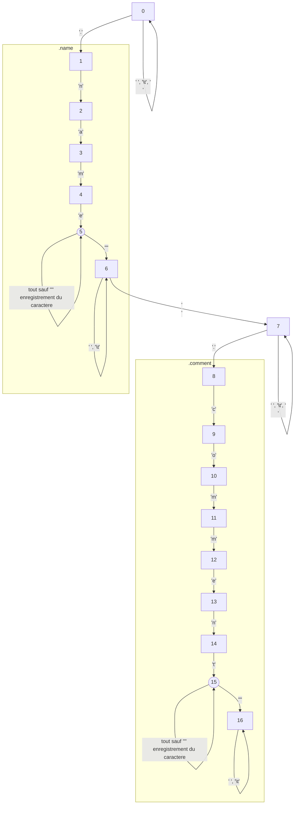

Corewar
=======

Last project of the algorithmic branch.

Module d'entrees / sorties
-----------------
Entrees / sorties bufferisees (GNL en mieux). Structure definie et initialisee separement donc pas besoin de malloc et de liste chainee.
```C
#define BUF_SIZE (1024)

typedef struct  s_openfile
{
    int     fd; // file descriptor
    char    buffer[BUF_SIZE]; // read/write buffer
    int     buf_size; // current size of the buffer
    char    pos; // current position in the buffer
}               t_openfile;
```
### FONCTIONS A IMPLEMENTER
#### Initialisation
##### Prototype
```C
void	openfile_init(t_openfile *of, int fd);
```
##### Effets
* of->fd doit etre egal a fd
* of->buf_size doit etre egal a zero
* of->pos doit etre egal a zero
##### Entrees
* of: pointeur vers le t_openfile a initialiser
* fd: file descriptor du fichier a lire / ecrire (ca peut etre aussi l'entree standard ou la sortie standard)
##### Exemple d'utilisation
```C
t_openfile  of;

openfile_init(&of, STDIN_FILENO);
if (err)
{
    printf("Error\n");
    exit(1);
}
```
#### Lecture d'un caractere
##### Prototype
```C
int		openfile_read_char(t_openfile *of, char *c);
```
##### Effets
* Si of->pos < of->buf_size:
   * *c prend la valeur de of->buffer[of->pos]
   * of->pos est incremente
* Sinon
   * of->buffer est lu depuis le file descriptior of->fd
   * of->buf_size est egal au nombre d'octets lus (zero si la fin de fichier est atteinte)
   * of->pos egal zero
##### Entrees
* of: pointeur vers le t_openfile du fichier a lire
##### Sorties
* c (passe par reference): caractere lu
* ret (valeur de retour): -1 en cas d'erreur, 0 en fin de fichier, 1 si le caractere a ete lu sans probleme
##### Exemple d'utilisation
```C
t_openfile  of;
int         ret;
char        c;

openfile_init(&of, STDIN_FILENO);
ret = openfile_read_char(&of, &c);
if (ret == 1)
	printf("Read character: %c\n", c);
```
#### Ecriture d'un caractere
##### Prototype
```C
void     openfile_write_char(t_openfile *of, char c);
```
##### Effets
* of->buffer[of->pos] prend la valeur c
* of->pos est incremente
* Si of->pos == BUF_SIZE:
   * of->buffer est ecrit dans of->fd (avec la taille BUF_SIZE)
   * of->pos est mis a zero
##### Entrees
* of: pointeur vers le t_openfile du fichier a ecrire
* c: caractere a ecrire
##### Exemple d'utilisation
```C
t_openfile  of;
int         ret;
char        c;

openfile_init(&of, STDOUT_FILENO);
openfile_write_char(&of, 'Y');
openfile_write_char(&of, 'o');
```
#### Ecriture des caracteres restants
```C
void	openfile_flush(t_openfile *of);
```
##### Effets
* of->buffer est ecrit dans of->fd (avec la taille of->pos)
* of->pos est mis a zero

Cette fonction est a appeler a la fin du programme pour ecrire les caracteres qui restent dans le buffer.
##### Entrees
* of: pointeur vers le t_openfile du fichier a ecrire
##### Exemple d'utilisation
```C
t_openfile  of;
int         ret;
char        c;

openfile_init(&of, STDOUT_FILENO);
openfile_write_char(&of, 'Y');
openfile_write_char(&of, 'o');
openfile_write_char(&of, '\n');
openfile_flush(&of);
```
#### Autres fonctions a ecrire
```C
	void openfile_write_str(t_openfile *fd, char *str, int endl);
	void openfile_write_nbr(t_openfile *fd, int nbr, int endl);
```

Parsing
-------


