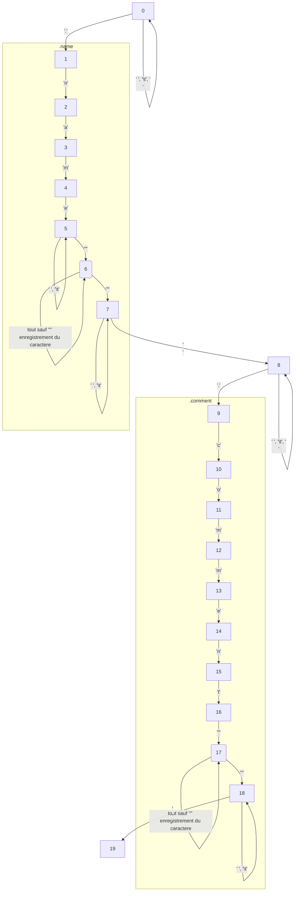

Parsing
=======

```mermaid
graph TB
    0-->|' ', '\t', '\n'|0
    0-->|'.'|1
    subgraph .name
        1-->|'n'|2
        2-->|'a'|3
        3-->|'m'|4
        4-->|'e'|5
        5-->|' ', '\t'|5
        5-->|"'#quot;'"|6(6)
        6-->|"tout sauf '#quot;' <br/>enregistrement du caractere"|6
        6-->|"'#quot;'"|7
    end
    7-->|' ', '\t'|7
    7-->|'\n'|8
    8-->|' ', '\t', '\n'|8
    8-->|'.'|9
    subgraph .comment
        9-->|'c'|10
        10-->|'o'|11
        11-->|'m'|12
        12-->|'m'|13
        13-->|'e'|14
        14-->|'n'|15
        15-->|'t'|16
        16-->|"'#quot;'"|17(17)
        17-->|"tout sauf '#quot;' <br/>enregistrement du caractere"|17
        17-->|"'#quot;'"|18
    end
    18-->|' ', '\t'|18
    18-->|'\n'|19
```
