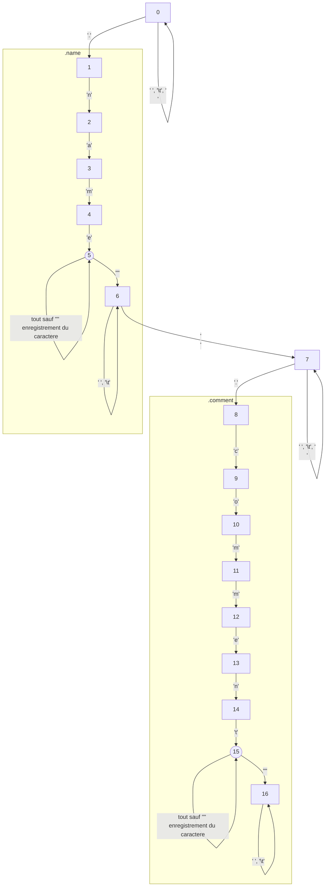

Parsing
=======

```mermaid
graph TB
    0-->|' ', '\t', '\n'|0
    0-->|'.'|1
    subgraph .name
        1-->|'n'|2
        2-->|'a'|3
        3-->|'m'|4
        4-->|'e'|5((5))
        5-->|"tout sauf '#quot;' <br/>enregistrement du caractere"|5
        5-->|"'#quot;'"|6
        6-->|' ', '\t'|6
    end
    6-->|'\n'|7
    7-->|' ', '\t', '\n'|7
    7-->|'.'|8
    subgraph .comment
        8-->|'c'|9
        9-->|'o'|10
        10-->|'m'|11
        11-->|'m'|12
        12-->|'e'|13
        13-->|'n'|14
        14-->|'t'|15((15))
        15-->|"tout sauf '#quot;' <br/>enregistrement du caractere"|15
        15-->|"'#quot;'"|16
        16-->|' ', '\t'|16
    end
```
